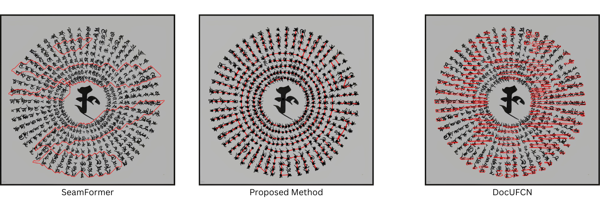

# Historical OCR Tool

This tools digitizes text from historical manuscripts in two steps:  

In step 1, text-lines of the the page are detected automatically (or semi-automatically for complex layouts).  

In step 2, the text content of the detected text-lines is recognized and converted to unicode text.

Once digitized, the manuscripts can be exported in the standard [PAGE-XML](https://en.wikipedia.org/wiki/Page_Analysis_and_Ground_Truth_Elements) format.


**Version:** 3.0  
**Last Updated:** March 26, 2026

## ✅ **Project Components**
*   **🚀 [Getting Started](https://github.com/flame-cai/gnn-synthetic-layout-historical#getting-started)** Clone repository and install conda environment
*   **🧩 [Semi-Automatic Annotation Tool](https://github.com/flame-cai/gnn-synthetic-layout-historical?tab=readme-ov-file#semi-automatic-annotation-tool):** Segment text-lines from complex layouts using Graph Neural Networks, followed by manual corrections to the output if required - supporting annotations at `character level`, `text-line level` and `text-box level`.
*   **💻 [Automatic Out-of-the-box Inference](https://github.com/flame-cai/gnn-synthetic-layout-historical?tab=readme-ov-file#automatic-out-of-the-box-inference):** Run fully automatic stand-alone inference using [CRAFT](https://github.com/clovaai/CRAFT-pytorch) + GNNs to perform text-line segmentation.
*   **🧠 [GNN Training Recipe](https://github.com/flame-cai/gnn-synthetic-layout-historical?tab=readme-ov-file#gnn-training-recipe):** Train custom GNN architectures using synthetic data, augmented real data.
*   **⚙️ [Synthetic Data Generator](https://github.com/flame-cai/gnn-synthetic-layout-historical?tab=readme-ov-file#-generate-synthetic-data):** Generate synthetic layout data simulating complex layouts in the graph based format
*   **📂 Dataset:** The dataset used in the paper is currently available in the 
  [`gram-submission`](https://github.com/flame-cai/gnn-synthetic-layout-historical/tree/gram-submission?tab=readme-ov-file) branch of this repository.


## 🚀 **Getting Started**
Clone the repository:
```bash
git clone --depth 1 https://github.com/flame-cai/gnn-synthetic-layout-historical.git
```

#### Install Conda Environment
Install [Conda](https://docs.conda.io/en/latest/miniconda.html) first, then run:

```bash
cd gnn-synthetic-layout-historical 
conda create -n gnn_layout python=3.11 -y
conda activate gnn_layout
pip install -r requirements.txt
```

## 🧩 **Semi Automatic Annotation Tool ```app/```**

Satisfactorily performing automatic text-line segmentation from diverse historical manuscripts necessitates annotation of the target dataset, which can require a significant amount of time and effort. 
Further more, automatically segmented text-lines using deep learning methods are often incorrectly predicted, especially on complex and dense pages, in low training data regimes. Manual correction of such _automatically but incorrectly_ segmented text-lines can also be time consuming.

The semi-automatic annotation tool presented in this work natively supports graph-based labelling, treating character locations as nodes, with characters of the same text-lines being connected together.
This graph based problem formulation easily supports working with irregular and curved text-lines, complex layouts, and attempts to make layout annotation and _layout post-correction_ less time consuming, by allowing the user to simply hover over edges while pressing the key `d` to delete them, and to hover over nodes while pressing the key `a` to connect them. The tool also supports `adding/deleting nodes`, and labelling at the `text-box level`.



When faced with **complex Out-of-Distribution layouts**, manually correcting _automatically but incorrectly_ segmented text-lines in a bounding polygon format, could perhaps be more time consuming than manually correcting predictions in a graph-based format, as illustrated in the above figure. The out-of-the-box predictions of leading methods DocUFCN and SeamFormer are in a bounding polygon format, and the prediction of the proposed method is in the graph-based format (which we believe to be less time consuming to post-correct). **The training data of the proposed method did not contain any circular layouts, thus also highlighting the generalizability of the proposed method to complex out-of-distribution layouts.**

It took `~12 hours` by `1 annotator` to label all `481 pages`  of the dataset presented. That version relied on a heuristic algorithm rather than a Graph Neural Network, so the annotation time is expected to be even lower with the current version of the tool, especially on Sanskrit manuscripts with complex layouts.


### ⚙️ Setup Instructions

#### 🔵 Setup Recognition Model (optional)

To recognize the unicode text-content from segmented text-line images, we need a text recognition model. To do this, the tool supports using **Gemini** (using API key), OR an **EasyOCR** based recognition model.

##### Gemini
If you are using Gemini for text recognition, you may need to adjust the prompt within the `_run_gemini_recognition_internal` function located in `app/app.py` based on your use case and the language/script of the manuscript in question.

By default, the application uses:
`model = genai.GenerativeModel('gemini-2.5-flash')`
You can update this string in the same function to utilize the latest Gemini releases.

To configure your Gemini API key:
1. Create an API key in [Google AI Studio](https://aistudio.google.com/).
2. Create a `.env` file in the `app/` directory (`app/.env`).
3. Add the following line to the file:
   ```env
   GEMINI_API_KEY="YOUR_API_KEY_HERE"
   ```


##### EasyOCR
To use EasyOCR for recognizing devanagari text, you will need to download the model as follows (or use your own finetuned one for other scripts)
```bash
cd app/recognition/pretrained_model
wget "https://docs.google.com/uc?export=download&id=1Mm0Keee3DQ4JY8Fe62zgBfRohdEHrfTk" -O vadakautuhala.pth
```
The **`vadakautuhala.pth`** recognition model is based on work done in: **[A Case Study of Handwritten Text Recognition from Pre-Colonial Era Sanskrit Manuscripts](https://aclanthology.org/2025.wsc-csdh.4.pdf)** by Chincholikar, Dwivedi, Gopalan and Awasthi (2025), and is specialized to recognize text from a common writing style found in the sanskrit manuscripts at the [Lalchand Research Library, DAV College, Chandigarh, India](https://dav.splrarebooks.com/). In the study, we observed that fine-tuning the recognition model to specific manuscripts is always benificial (in terms of Character error rate).


#### 🔵 Start Backend Server
```bash
cd app
conda activate gnn_layout
python app.py
```

The server runs on `http://localhost:5000`.

#### 🔵 Start Frontend
First install npm from [Node.js official website](https://nodejs.org/en/download/). 

Create a .env file in `app/frontend/` with the following content, replacing the backend URL if different from `http://localhost:5000`:

```env
VITE_BACKEND_URL="http://localhost:5000"
```

Then run:

```bash
cd app/frontend
npm install
npm run dev
```
Access the UI at `http://localhost:5173`.

```npm install``` only needs to be run once for the first time. To launch the front-end subsequently, we need to only need to run ```npm run dev```.


#### Automated Evaluation Check (GUI-free)
To run the same end-to-end validation flow without opening the GUI, use the dedicated integration test from the `app/` directory:

```bash
cd app
conda activate gnn_layout
python -m unittest discover -s tests -p "test_ci_e2e.py" -v
```

To make this test run automatically before every commit in a fresh clone, configure the repository hooks once from the repository root:

```bash
python scripts/install_git_hooks.py
```

On Windows, `py -3 scripts/install_git_hooks.py` is also fine.

This test automatically uploads the 15-page evaluation dataset in `app/tests/eval_dataset/images/`, runs CRAFT + GNN inference, saves PAGE-XML outputs, runs local OCR recognition on every page, evaluates the predictions against `app/tests/eval_dataset/labels/PAGE-XML/`, and writes reports to:
- `app/tests/logs/ci_eval_results_latest.txt`
- `app/tests/logs/ci_eval_results_latest.json`

By default the temporary manuscript artifacts are deleted after the test. Set `KEEP_CI_ARTIFACTS=1` before the command if you want to inspect the generated manuscript outputs under `app/input_manuscripts/_ci_root/`.

The pre-commit launcher tries to find the `gnn_layout` Python automatically. If your environment lives in a non-standard location, set `GNN_LAYOUT_PYTHON` to the full path of that environment's Python executable before committing.

If you intentionally need to bypass the pre-commit evaluation once, use standard git bypass with `git commit --no-verify`. The hook also supports `SKIP_EVAL_HOOK=1` for one-off local debugging.

The longer-term evaluation blueprint for automatic tests, GUI tests, and future human-in-the-loop active-learning studies lives in `EVAL.md`.

##  💻 **Graph Neural Network based Text-Line Segmentation Core ```src/```**
Perform text-line segmentation in fully automatic GNN inference on sample manuscripts, to obtain text-line segmented images in PAGE-XML format, GNN format, and as individual line images. This section also allows generating synthetic layout data, augmenting real layout data, preparing data for training GNNs, and the training recipe for GNNs.

#### 🔵 Run Inference (fully automatic)
```bash
cd src/gnn_inference
conda activate gnn_layout
python inference.py --manuscript_path "./demo_manuscripts/sample_manuscript_1/"
```

This will process all the manuscript images in sample_manuscript_1 and save the segmented line images in folder `sample_manuscript_1/layout_analysis_output/` in PAGE_XML format, GNN format, and as individual line images.

> **NOTE 1:**  
> This project is made for Handwritten Sanskrit Manuscripts in Devanagari script, however it will work reasonibly well on other scripts if they fit the following criteria:
> 1) [CRAFT](https://github.com/clovaai/CRAFT-pytorch) successfully detects the script characters  
> 2) Character spacing is less than Line spacing. 
>
> If the output is not satisfactory, please use the Semi-Autonomous Mode to make corrections (add/delete edges or nodes, label text boxes etc.)


> **NOTE 2:**  
> `sample_manuscript_1/` and `sample_manuscript_2` contain high resolution images and will work out of the box. However, `sample_manuscript_3/` contains lower resolution images - for whom the feature engineering parameter `min_distance` in `src/gnn_inference/segmentation/segment_graph.py` will need to be reduced from `20` to `10` as follows:
> ```python
> `raw_points = heatmap_to_pointcloud(region_score, min_peak_value=0.4, min_distance=10)`
> ```
> The inference code resizes very large images to `2500` longest side for processing to reduce the GPU memory requirements and to standardize the feature extraction process. If you wish to change this limit, you can do so in `src/gnn_inference/inference.py` at the following lines:
> ```python
> target_longest_side = 2500
> ```
> However, this is also require adjusting the feature extraction parameter `min_distance` in `src/gnn_inference/segmentation/segment_graph.py` accordingly.


## 🧠 **GNN Training Recipe**
The following instructions will help you configure parameters to generate synthetic layout data, augment the Sanskrit dataset, prepare data for GNN training, and train custom GNN architectures to perform text-line segmentation, which is formulated as an edge classification task.


#### 🔵 Activate Conda Environment
Activate the conda environment if not already done:
```bash
cd src
conda activate gnn_layout
```

#### 🔵 Generate Synthetic Data
Configure the parameters in `src/configs/synthetic.yaml` as needed, then run:
```bash
cd src

python synthetic_data_gen/generate.py --dry-run --config configs/synthetic.yaml  # to visualize a few samples
python synthetic_data_gen/generate.py --config configs/synthetic.yaml
```

This will create a new folder `src/gnn_data/synthetic_layout_data/` with all the generated synthetic data files in the graph based format.

This script peforms domain randomization to generate synthetic layout data simulating complex layouts in the graph based formulation introduced in this project. Both the synthetic data and the real data use the same graph based format, making it easy to integrate synthetic data into training pipelines.

#### 🔵 To Augment Sanskrit Dataset
Configure the parameters in `src/configs/augment.yaml` as needed, then run:
```bash
cd src

python synthetic_data_gen/augment.py \
--config configs/augment.yaml \
--input_dir "gnn_data/flattened_sanskrit_data/gnn-dataset" \
--output_dir "gnn_data/augmented_sanskrit_dataset/"
```
This will create a new folder `src/gnn_data/augmented_sanskrit_dataset/` with three subfolders: `train`, `val` and `test`. `train` will contain the augmented training samples, while `val` and `test` will contain the original validation and test samples respectively.


#### 🔵 Create Combined Dataset (Synthetic + Augmented Real Data)
First, copy synthetic data, augmented sanskrit data (training set) into a single folder. For example, you can create a new folder `src/gnn_data/combined_data/` and copy the following into it:
```bash
cd src

mkdir -p gnn_data/combined_data/

rsync -a gnn_data/generated_synthetic_data/ gnn_data/combined_data/
rsync -a gnn_data/augmented_sanskrit_dataset/train/ gnn_data/combined_data/
echo "augmented real data + synthetic data prepared at: gnn_data/combined_data/"
```

Hence our training dataset will be at `src/gnn_data/combined_data/`
validation dataset at `src/gnn_data/augmented_sanskrit_dataset/val/` 
and test dataset at `src/gnn_data/augmented_sanskrit_dataset/test/` (unused as of now).

#### 🔵 Prepare Data for GNN Training
First configure the data preprocessing parameters in `src/configs/gnn_preprocessing.yaml` as needed, then run:
```bash
cd src

python gnn_training/gnn_data_preparation/main_create_dataset.py \
--config configs/gnn_preprocessing.yaml \
--train_data_dir gnn_data/combined_data/ \
--val_test_data_dir gnn_data/augmented_sanskrit_dataset/val/ \
--output_dir gnn_data/processed_data_gnn/
```
This will create a new folder `src/gnn_data/processed_data_gnn/` with all the processed data files ready for GNN training (node features, edge features, labels etc.).

#### 🔵 Train GNN Model
First configure the GNN training parameters in `src/configs/gnn_training.yaml` as needed, then run:
```bash
cd src

python -m gnn_training.training.main_train_eval \
--config "configs/gnn_training.yaml" \
--dataset_path "gnn_data/processed_data_gnn/" \
--unique_folder_name "gnn_experiment_1" \
--gpu_id 0
```
This will create a new folder `src/gnn_training/training_runs/gnn_experiment_1/`.

---

## Cross-Platform Notes

Windows:
- Prefer PowerShell commands and Windows path separators when giving examples to Windows users.
- `wget` may not be available; use browser download, `curl -L -o`, or PowerShell alternatives.
- `rsync` commands in the README are Unix-oriented. On Windows, use File Explorer, `Copy-Item`, or a Python copy script if absolutely necessary.

macOS/Linux:
- Shell examples from the README will usually work directly.
- Ensure `conda` is initialized in the shell.

GPU considerations:
- If CUDA is available, the code will usually use it automatically.
- If CUDA is unavailable, tell the user inference and training may be much slower.
- Do not assume multi-GPU support is stable everywhere just because a helper exists.

## ♥️ Acknowledgements
This is work done at the Centre for Interdisciplinary Artificial Intelligence (CAI), FLAME University and is based on the following papers:

#### **Towards Text-Line Segmentation of Historical Documents Using Graph Neural Networks**
[Kartik Chincholikar](https://kartikchincholikar.github.io/) · [Kaushik Gopalan](https://www.linkedin.com/in/kaushik-gopalan-b6533624/) · [Mihir Hasabnis](https://www.linkedin.com/in/mihir-hasabnis-4078a01b/)  
ICLR 2026 Workshop on Geometry-grounded Representation Learning and Generative Modeling  
[📄 Paper](https://openreview.net/forum?id=0GoutqIh3l) | [🌐 Project Website](https://kartikchincholikar.github.io/gnn-layout-analysis/)  
In this work we present an initial investigation into a Graph Neural Network (GNN) friendly problem formulation for performing text-line segmentation, representing each character(or grapheme cluster) as a node in the graph, with edges connecting characters of the same text-line.

```bibtex
@inproceedings{chincholikar2026towards,
  title={Towards Text-Line Segmentation of Historical Documents Using Graph Neural Networks},
  author={Kartik Chincholikar and Kaushik Gopalan and Mihir Hasabnis},
  booktitle={ICLR 2026 Workshop on Geometry-grounded Representation Learning and Generative Modeling},
  year={2026},
  url={https://openreview.net/forum?id=0GoutqIh3l}
}
```

---


#### **A Case Study of Handwritten Text Recognition from Early Modern Sanskrit Manuscripts**
[Kartik Chincholikar](https://kartikchincholikar.github.io/) · [Shagun Dwivedi](https://shagundwivedi.github.io/) · [Kaushik Gopalan](https://www.linkedin.com/in/kaushik-gopalan-b6533624/?originalSubdomain=in) · [Tarinee Awasthi](https://www.linkedin.com/in/tarinee-awasthi-89883a244/)  
Proceedings of the Workshop on Computational Sanskrit & Digital Humanities, World Sanskrit Conference 2025  
[📄 Paper](https://aclanthology.org/2025.wsc-csdh.4.pdf) | [💻 Code](https://github.com/flame-cai/case-study-handwritten-sanskrit-ocr)  
In this case study, we perform Handwritten Text Recognition on Sanskrit manuscripts from the Early Modern period, namely _Vādakautūhala_ of Svāmiśāstrin and Bhāskararāya (early eighteenth century), and _Mahāvākyārtha_ and _Dvādaśamahāvākyārthavicāra_ of unknown authorship.

```bibtex
@inproceedings{chincholikar2025case,
  title={A Case Study of Handwritten Text Recognition from Pre-Colonial era Sanskrit Manuscripts},
  author={Chincholikar, Kartik and Dwivedi, Shagun and Gopalan, Kaushik and Awasthi, Tarinee},
  booktitle={Computational Sanskrit and Digital Humanities-World Sanskrit Conference 2025},
  pages={52--69},
  year={2025}
}
```

---

#### **A Semi-Automatic Text Recognition Tool for Pre-Colonial Handwritten Manuscripts in Devanāgari Script**
[Bharath Valaboju](https://Bharath314.github.io/) · [Shagun Dwivedi](https://shagundwivedi.github.io/) · [Kartik Chincholikar](https://kartikchincholikar.github.io/) · [Kaushik Gopalan](https://www.linkedin.com/in/kaushik-gopalan-b6533624/?originalSubDomain=in) · [Shivkiran Chitkulwar](https://github.com/SSCoderin) · [Vinod Vidwans](https://www.linkedin.com/in/vinod-vidwans-2b57b4b/?originalSubDomain=in)  
International Conference on Human-Computer Interaction, Springer 2025  
[📄 Paper](https://link.springer.com/chapter/10.1007/978-3-031-94171-9_13)  
This poster presents an annotation tool which allows the user to extract text from undigitized manuscripts using OCR, following which users can make corrections to the OCR-detected text. Users can then request fine tuning on a few pages corrected by them, making the annotation process easier and more efficient for the subsequent pages by improving OCR performance.

```bibtex
@inproceedings{valaboju2025semi,
  title={A Semi-Automatic Text Recognition Tool for Pre-Colonial Handwritten Manuscripts in Devan{\=a}gari Script},
  author={Valaboju, Bharath and Dwivedi, Shagun and Chincholikar, Kartik and Gopalan, Kaushik and Vidwans, Vinod},
  booktitle={International Conference on Human-Computer Interaction},
  pages={152--160},
  year={2025},
  organization={Springer}
}
```

---

The authors also wish to express their thanks to [Lalchand Research Library, DAV College, Chandigarh, India](https://dav.splrarebooks.com/), DAV College, Chandigarh, India, for making manuscript data available for educational and research purposes.
The authors also wish to express their gratitude to the anonymous reviewers, Ansh Kushwaha, Dr. Petar Veličković, Dr. Dhaval Patel, and Dr. Oliver Hellwig for their invaluable guidance and support.
