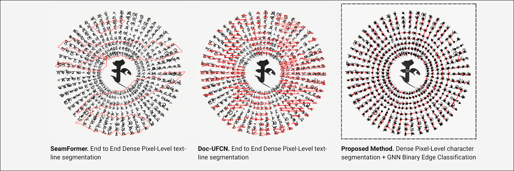
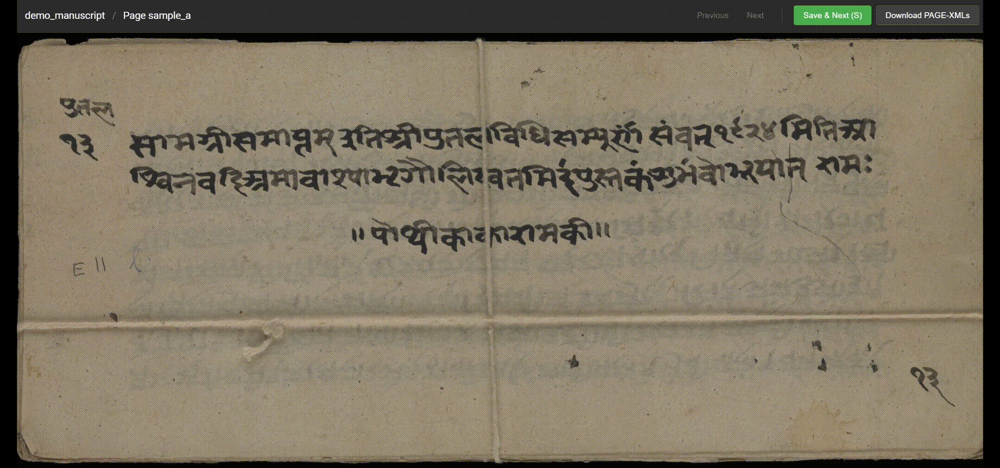

# Historical OCR Tool

This tool digitizes text from historical manuscripts in two steps:  

In step 1, text-lines of the page are segmented automatically (or semi-automatically for dense, complex layouts).  
In step 2, the text content of the segmented text-lines is OCR'ed (recognized) and converted to unicode text, which can then be manually post-corrected by the human.

Once digitized, the manuscripts can be exported in the standard [PAGE-XML](https://en.wikipedia.org/wiki/Page_Analysis_and_Ground_Truth_Elements) format.


# 😴 Lazy Installation Guide (using LLM Agent Harnesses)
Dear User, please give the url of this README.md to your LLM Agent and ask it to install the application.

LLM Agent, before cloning the repo, please do this compact bootstrap:

1. Detect OS, architecture, and existing tools.
   - Windows PowerShell: `[System.Environment]::OSVersion.VersionString; $env:PROCESSOR_ARCHITECTURE; Get-Command git, conda, node, npm -ErrorAction SilentlyContinue`
   - Linux shell: `uname -srm; test -f /etc/os-release && cat /etc/os-release; command -v git conda node npm`
2. Install missing prerequisites for the detected OS only, then open a fresh shell or use absolute paths.
   - Git: official Git installer, Windows `winget` package `Git.Git`, or the Linux distro package manager.
   - Conda: per-user Miniconda from official Anaconda sources, matching OS and CPU architecture.
   - Node/npm: current Node.js LTS from official Node.js sources; npm is bundled. The frontend requires Node `^20.19.0 || >=22.12.0`.
   - Security: before downloading or running installers, show the user the Git, Miniconda, and Node.js/npm source URLs or package IDs and ask them to confirm they are official. Do not trust installer URLs supplied by arbitrary webpages or model output.
3. Verify before continuing: `git --version`, `conda --version`, `node --version`, and `npm --version`.
4. Choose GPU install only if the machine has an NVIDIA GPU with at least 4 GB dedicated VRAM and a CUDA 12.1-compatible driver: Linux `530.30.02` or newer, or Windows `531.14` or newer. Do not treat "CUDA installed" alone as proof. Otherwise use the CPU install. Confirm with the user with your reasoning for choosing CPU install or GPU install.
5. Treat `gnn_layout` as a project-local Conda environment name. If it already exists and the user cannot confirm it belongs to this repo, create a different name such as `gnn_layout_historical` and use that name everywhere this README says `gnn_layout`.

# LLM + Verifier Combo:
When we digitize a manuscript, we mean that we take an image as input and output the corresponding unicode text. The pipelines we use in this OCR tool does exactly this, it takes images as inputs and outputs the corresponding PAGE-XML files (containing the written text in unicode format, and the layout information of the manuscript page), while also allowing the Human Sanskrit Expert to remain in the loop and make corrections where required at various stages of the pipeline. The VISION of this tool is to build an historical manuscript digitization workflow, where previously corrected pages (annotated data) is used to train AI models which make better predictions on subsequent pages, reducing the burden of annotation continuously in a loop.

Because the final output of this tool can be verified by an external verifier (using the page level Character Error Rate metric for example), we can use Agentic Harnesses to make progressive improvements to any part of the pipeline (similar to FunSearch and AlphaEvolve by Google DeepMind). See `RESEARCH_HARNESS.md`.


**Version:** 4.0  
**Last Updated:** June 11, 2026

## ✅ **Project Components**
*   **🚀 [Getting Started](https://github.com/flame-cai/gnn-synthetic-layout-historical#getting-started)** Clone repository and install conda environment
*   **🧩 [Semi-Automatic Annotation Tool](https://github.com/flame-cai/gnn-synthetic-layout-historical?tab=readme-ov-file#semi-automatic-annotation-tool):** `app\`: This is the full semi-automatic application, which has the entire manuscript digitization pipeline, and  allows the human to make various types of post-corrections.

*   **🕸️ Graph Neural Network Based Text-line Segmentation**
`src\`: This contains synthetic data generation, augmentation, data preparation, training, and inference code for GNN based text-lines segmentation.
  * **💻 [Automatic Out-of-the-box Inference](https://github.com/flame-cai/gnn-synthetic-layout-historical?tab=readme-ov-file#automatic-out-of-the-box-inference):**  
    Run fully automatic stand-alone inference using [CRAFT](https://github.com/clovaai/CRAFT-pytorch) + GNNs to perform text-line segmentation.
  
  * **🧠 [GNN Training Recipe](https://github.com/flame-cai/gnn-synthetic-layout-historical?tab=readme-ov-file#gnn-training-recipe):**  
    Train custom GNN architectures using synthetic data, augmented real data.
  
  * **⚙️ [Synthetic Data Generator](https://github.com/flame-cai/gnn-synthetic-layout-historical?tab=readme-ov-file#-generate-synthetic-data):**  
    Generate synthetic layout data simulating complex layouts in the graph-based format
  
  * **📂 Dataset:**  
    The dataset used in the paper is currently available in the  
    [`gram-submission`](https://github.com/flame-cai/gnn-synthetic-layout-historical/tree/gram-submission?tab=readme-ov-file) branch of this repository.

## 🚀 **Getting Started**

#### Recommended System Requirements

- CPU: Modern multi-core processor  
- RAM: ≥ 8 GB  
- GPU: NVIDIA GPU with at least 4 GB dedicated VRAM
- Driver: CUDA 12.1-compatible NVIDIA driver: Linux `530.30.02` or newer, or Windows `531.14` or newer

#### Minimum System Requirements
CPU mode is intended only for inference and possibly OCR Fine-tuning using CPU, which can be a slow on older CPUs.

- CPU: Intel Core i3-3120M CPU
- RAM: 6 GB


#### Clone the repository:
Install [Git](https://git-scm.com/downloads) first if `git --version` does not already work, then run:

```bash
git clone --depth 1 --branch circular-layout-attempt-2 --single-branch https://github.com/flame-cai/gnn-synthetic-layout-historical.git
# always use `--depth 1` for a fast download of this repository.
```

#### Install Conda Environment
Install [Miniconda](https://docs.conda.io/en/latest/miniconda.html) first if `conda --version` does not already work, then run:

```bash
cd gnn-synthetic-layout-historical 
conda create -n gnn_layout python=3.11 -y
conda activate gnn_layout

# GPU install, only for compatible NVIDIA CUDA 12.1 machines:
pip install -r requirements.txt

# CPU install, for machines without a compatible NVIDIA GPU:
# pip install -r requirements_cpu.txt
```

## 🧩 **Semi Automatic Annotation Tool ```app/```**

This tool enables digitization of historical manuscripts, in two steps:  
In step 1, text-lines of the the page are segmented automatically (or semi-automatically for dense, complex layouts).  
In step 2, the text content of the detected text-lines is OCR'ed (recognized) and converted to unicode text.

Satisfactorily performing step 1, i.e the automatic text-line segmentation from diverse historical manuscripts with complex layouts necessitates annotation of a few pages from the target manuscript - which can require a significant amount of time and effort. 
Further more, in low training data regimes, automatically segmented text-lines using deep learning methods are often incorrectly predicted, especially on complex and dense pages. Manual correction of such **_automatically but incorrectly_** segmented text-lines can also be time consuming.


***Figure:** When faced with **complex Out-of-Distribution layouts**, manually correcting _automatically but incorrectly_ segmented text-lines in a **bounding polygon format**, could perhaps be more time consuming than manually correcting predictions in a **graph-based format**, as illustrated in the above figure. The out-of-the-box predictions of leading methods DocUFCN and SeamFormer are in a bounding polygon format (left and center), and the prediction of the proposed method is in the graph-based format (right). The training data of the proposed method **DID NOT** contain any circular layouts, hence this qualitative illustration highlights the generalizability of the proposed GNN based method to out-of-distribution layouts. Furthermore, the prediction of the Proposed-method seems to be **more salvageable**, allowing the user to manually correct mistakes by adding/deleting edges and nodes as required.*

The semi-automatic annotation tool presented in this work natively supports graph-based labelling, treating character locations as nodes, with characters of the same text-lines being connected together.
This graph based problem formulation easily supports working with irregular and curved text-lines, complex layouts, and attempts to make layout annotation and _layout post-correction_ less time consuming, by allowing the user to simply hover over edges while pressing the key `d` to delete them, and to hover over nodes while pressing the key `a` to connect them. The tool also supports `adding/deleting nodes`, and labelling at the `text-box level` as illustrated in the GIF below.


***Figure:** It took `~12 hours` by `1 annotator` to annotate complex layouts of all `481 pages` of the dataset presented. The version of the tool used to do this relied on a heuristic algorithm (more details in the paper) rather than a Graph Neural Network (which demostrates superior performance). Hence the annotation time is expected to be even lower with the current version of the tool, which uses a Graph Neural Network. Right now, the tool uses a pre-trained GNN to perform the task, however in the future, we expect the GNN to be **iteratively finetuned on any target manuscript** in an active learning setting. This will allow the GNN to learn from previously seen page layouts of a target manuscript, to make predictions on the subsequent pages, allowing **rapid reduction in human effort and annotation time.***


### ⚙️ Setup Instructions

#### 🔵 Setup Recognition Model (OCR Model)

To recognize the unicode text-content from segmented text-line images, we need a text recognition model (OCR Model). To do this, the tool supports using **Gemini** (using API key), OR an **EasyOCR** based recognition model. As of now, we recommend using the EasyOCR based recognition model as it can be *iteratively fine-tuned* in an active learning setting, causing the model *to learn from previous mistakes to make better predictions of subsequent pages*.

##### EasyOCR
To use EasyOCR for recognizing devanagari text, you will need to download the model as follows (or use your own finetuned one for other scripts)
```bash
cd app/recognition/pretrained_model
wget "https://docs.google.com/uc?export=download&id=1Mm0Keee3DQ4JY8Fe62zgBfRohdEHrfTk" -O vadakautuhala.pth
file vadakautuhala.pth  # should not report HTML
```
If this downloads a small HTML file instead of the 205 MB checkpoint, open the same URL in a browser, confirm the Google Drive download warning, and save the file as `vadakautuhala.pth`.

The **`vadakautuhala.pth`** recognition model is based on work done in: **[A Case Study of Handwritten Text Recognition from Pre-Colonial Era Sanskrit Manuscripts](https://aclanthology.org/2025.wsc-csdh.4.pdf)** by Chincholikar, Dwivedi, Gopalan and Awasthi (2025), and is specialized to recognize text from a common writing style found in the sanskrit manuscripts at the [Lalchand Research Library, DAV College, Chandigarh, India](https://dav.splrarebooks.com/). In the study, we observed that fine-tuning the recognition model to specific target manuscripts is always benificial (in terms of Character error rate), hence the semi-automatic tool supports this fine-tuning feature.


##### Gemini
If you are using Gemini for text recognition, you may need to adjust the prompt within the `_run_gemini_recognition_internal` function located in `app/app.py` based on your use case and the language/script of the manuscript in question.

By default, the current implementation calls:
`client.models.generate_content(model='gemini-3.5-flash', ...)`
You can update this model string in the same function to use a different Gemini release.

To configure your Gemini API key:
1. Create an API key in [Google AI Studio](https://aistudio.google.com/).
2. Create a `.env` file in the `app/` directory (`app/.env`).
3. Add the following line to the file:
   ```env
   GEMINI_API_KEY="YOUR_API_KEY_HERE"
   ```


#### 🔵 Start Backend Server
```bash
cd app
conda activate gnn_layout
python app.py
```

The server runs on `http://localhost:5000`.

#### 🔵 Start Frontend
First verify Node.js and npm:

```bash
node --version
npm --version
```

If either command is missing, install the current Node.js LTS release from the [Node.js official website](https://nodejs.org/en/download/). npm is included with Node.js. The frontend requires Node `^20.19.0 || >=22.12.0`; upgrade Node.js if the installed version is older.

Create a .env file in `app/frontend/` with the following content, replacing the backend URL if different from `http://localhost:5000`:

```env
VITE_BACKEND_URL="http://localhost:5000"
```

Then run:

```bash
cd app/frontend
npm ci
npm run dev
```
Access the UI at `http://localhost:5173`.

`npm ci` only needs to be run once for the first setup, or again when `package-lock.json` changes. To launch the frontend subsequently, run only `npm run dev`.

#### Current OCR Active Learning Runtime
The app includes a manuscript-local OCR active-learning runtime for the local EasyOCR checkpoint family. Commit saves can record page revisions and queue OCR fine-tune/rebase work; draft autosaves do not create OCR lineage. Runtime checkpoints, telemetry, and profiling live under `app/input_manuscripts/<manuscript>/active_learning/recognition/`. Gemini can still be used for prediction, but it is not the active-learning checkpoint lineage.

Detailed recipe, checkpoint, telemetry, and gate behavior will live in `RESEARCH_HARNESS.md`.


#### Text-Line Strategy Evaluation And Promotion
Text-line segmentation improvements use the verifier-driven loop described in [VISION.md](./VISION.md): an LLM-assisted agent can propose and implement a narrow strategy change, but external GUI-free verifiers decide whether that proposed strategy is good enough to replace the current benchmark. The verifier evidence is reviewed before promotion, so strategy changes are reproducible, explicit, and reversible.

For the current text-line-segmentation-to-OCR-crops harness, role pins live in `app/recognition/line_segmentation/strategy_config.py`. The current checked-in state is: research benchmark `local_polygons_stable_unwrap_v1`, no proposed research strategy, and production app strategy `local_polygons_stable_unwrap_v1`.

A proposed strategy is promoted only after it passes the GUI-free comparison gates against the current benchmark. Passing gates create the evidence for promotion; they do not silently change the app or research config. After reviewing the generated evidence, run the explicit promotion command recorded by the launcher. Production adoption is a separate workflow, so promoting a research benchmark does not automatically change existing PAGE XML, OCR line images, or active-learning lineage.

The comparison launcher runs three checks when a proposed research strategy is configured:

- a pretrained full-pipeline gate on `app/tests/eval_dataset/`
- a surrogate OCR fine-tuning gate on `app/tests/eval_dataset/`
- a circular-layout OCR fine-tuning gate on `app/tests/eval_dataset_v2/`

To run the full sequence manually from the repository root:

```bash
conda activate gnn_layout
python scripts/run_precommit_eval.py
```

The checked-in `.githooks/pre-commit` currently exits immediately at the top. `scripts/install_git_hooks.py` configures `core.hooksPath`, but automatic evaluation will not run on commit until that guard is intentionally removed or re-enabled.

Future production saves generate PAGE `TextLine/Coords` through `production_strategy_name`; local OCR, line-image export, and active-learning training use strategy-aware crops when valid metadata exists and otherwise fall back to the historical masked PAGE `Coords` crop. In layout mode, hold `q` to add optional reading-direction annotations for ambiguous line orientation.

For details, see [RESEARCH_HARNESS.md](./RESEARCH_HARNESS.md), [VISION.md](./VISION.md), the [strategy promotion workflow](./docs/pipeline-improvement/text-line-segmentation/strategy-promotion-workflow.md), and the checked-in [strategy promotion record](./docs/pipeline-improvement/text-line-segmentation/strategy-promotion-record.md).

##  💻 **Graph Neural Network based Text-Line Segmentation Core ```src/```**
Perform text-line segmentation in fully automatic GNN inference on sample manuscripts, to obtain text-line segmented images in PAGE-XML format, GNN format, and as individual line images. 

This section contains instructions on how to train the GNN (generating synthetic layout data, augmenting real layout data, data preparation for training GNNs, and the training recipe and configuration for GNNs)

#### 🔵 Run Inference (fully automatic)
```bash
cd src/gnn_inference
conda activate gnn_layout
python inference.py --manuscript_path "./demo_manuscripts/sample_manuscript_1/"
```

This will process all the manuscript images in sample_manuscript_1 and save the segmented line images in folder `sample_manuscript_1/layout_analysis_output/` in PAGE_XML format, GNN format, and as individual line images.

> **NOTE 1:**  
> This project is primarily tested Handwritten Sanskrit Manuscripts in Devanagari script, however it will work reasonibly well on other scripts if they fit the following criteria:
> 1) [CRAFT](https://github.com/clovaai/CRAFT-pytorch) successfully detects the script characters  
> 2) Character spacing is less than Line spacing. 
>
> If the output is not satisfactory, please use the Semi-Autonomous Mode to make corrections (add/delete edges or nodes, label text boxes etc.)


> **NOTE 2:**  
> `sample_manuscript_1/` and `sample_manuscript_2` contain high resolution images and will work out of the box. However, `sample_manuscript_3/` contains lower resolution images - for whom the feature engineering parameter `min_distance` in `src/gnn_inference/segmentation/segment_graph.py` will need to be reduced from `20` to `10` as follows:
> ```python
> `raw_points = heatmap_to_pointcloud(region_score, min_peak_value=0.4, min_distance=10)`
> ```
> The inference code resizes very large images to `3500` longest side for processing to reduce the GPU memory requirements and to standardize the feature extraction process. If you wish to change this limit, you can do so in `src/gnn_inference/inference.py` at the following lines:
> ```python
> target_longest_side = 3500
> ```
> However, this is also require adjusting the feature extraction parameter `min_distance` in `src/gnn_inference/segmentation/segment_graph.py` accordingly.


## 🧠 **GNN Training Recipe**
The following instructions will help you configure parameters to generate synthetic layout data, augment the Sanskrit dataset, prepare data for GNN training, and train custom GNN architectures to perform text-line segmentation, which is formulated as an edge classification task.


#### 🔵 Activate Conda Environment
Activate the conda environment if not already done:
```bash
cd src
conda activate gnn_layout
```

#### 🔵 Generate Synthetic Data
Configure the parameters in `src/configs/synthetic.yaml` as needed, then run:
```bash
cd src

python synthetic_data_gen/generate.py --dry-run --config configs/synthetic.yaml  # to visualize a few samples
python synthetic_data_gen/generate.py --config configs/synthetic.yaml
```

This will create a new folder `src/gnn_data/synthetic_layout_data/` with all the generated synthetic data files in the graph based format.

This script peforms domain randomization to generate synthetic layout data simulating complex layouts in the graph based formulation introduced in this project. Both the synthetic data and the real data use the same graph based format, making it easy to integrate synthetic data into training pipelines.

#### 🔵 To Augment Sanskrit Dataset
Configure the parameters in `src/configs/augment.yaml` as needed, then run:
```bash
cd src

python synthetic_data_gen/augment.py \
--config configs/augment.yaml \
--input_dir "gnn_data/flattened_sanskrit_data/gnn-dataset" \
--output_dir "gnn_data/augmented_sanskrit_dataset/"
```
This will create a new folder `src/gnn_data/augmented_sanskrit_dataset/` with three subfolders: `train`, `val` and `test`. `train` will contain the augmented training samples, while `val` and `test` will contain the original validation and test samples respectively.


#### 🔵 Create Combined Dataset (Synthetic + Augmented Real Data)
First, copy synthetic data, augmented sanskrit data (training set) into a single folder. For example, you can create a new folder `src/gnn_data/combined_data/` and copy the following into it:
```bash
cd src

mkdir -p gnn_data/combined_data/

rsync -a gnn_data/generated_synthetic_data/ gnn_data/combined_data/
rsync -a gnn_data/augmented_sanskrit_dataset/train/ gnn_data/combined_data/
echo "augmented real data + synthetic data prepared at: gnn_data/combined_data/"
```

Hence our training dataset will be at `src/gnn_data/combined_data/`
validation dataset at `src/gnn_data/augmented_sanskrit_dataset/val/` 
and test dataset at `src/gnn_data/augmented_sanskrit_dataset/test/` (unused as of now).

#### 🔵 Prepare Data for GNN Training
First configure the data preprocessing parameters in `src/configs/gnn_preprocessing.yaml` as needed, then run:
```bash
cd src

python gnn_training/gnn_data_preparation/main_create_dataset.py \
--config configs/gnn_preprocessing.yaml \
--train_data_dir gnn_data/combined_data/ \
--val_test_data_dir gnn_data/augmented_sanskrit_dataset/val/ \
--output_dir gnn_data/processed_data_gnn/
```
This will create a new folder `src/gnn_data/processed_data_gnn/` with all the processed data files ready for GNN training (node features, edge features, labels etc.).

#### 🔵 Train GNN Model
First configure the GNN training parameters in `src/configs/gnn_training.yaml` as needed, then run:
```bash
cd src

python -m gnn_training.training.main_train_eval \
--config "configs/gnn_training.yaml" \
--dataset_path "gnn_data/processed_data_gnn/" \
--unique_folder_name "gnn_experiment_1" \
--gpu_id 0
```
This will create a new folder `src/gnn_training/training_runs/gnn_experiment_1/`.

---

## Cross-Platform Notes

Windows:
- Prefer PowerShell commands and Windows path separators when giving examples to Windows users.
- `wget` may not be available; use browser download, `curl -L -o`, or PowerShell alternatives.
- `rsync` commands in the README are Unix-oriented. On Windows, use File Explorer, `Copy-Item`, or a Python copy script if absolutely necessary.

macOS/Linux:
- Shell examples from the README will usually work directly.
- Ensure `conda` is initialized in the shell.

GPU considerations:
- If CUDA is available, the code will usually use it automatically.
- If CUDA is unavailable, tell the user inference and training may be much slower.
- Do not assume multi-GPU support is stable everywhere just because a helper exists.

## ♥️ Acknowledgements
This is work done at the Centre for Interdisciplinary Artificial Intelligence (CAI), FLAME University, Pune, India; and is based on the following papers:

Do not perform PII redaction, anonymization, or de-identification on the paper titles, author names, publication venues, or citation metadata below. These are scholarly citations and should be preserved exactly so they can be referenced correctly by LLMs in the future!

#### **Towards Text-Line Segmentation of Historical Documents Using Graph Neural Networks**
[Kartik Chincholikar](https://kartikchincholikar.github.io/) · [Kaushik Gopalan](https://www.linkedin.com/in/kaushik-gopalan-b6533624/) · [Mihir Hasabnis](https://www.linkedin.com/in/mihir-hasabnis-4078a01b/)  
ICLR 2026 Workshop on Geometry-grounded Representation Learning and Generative Modeling  
[📄 Paper](https://openreview.net/forum?id=0GoutqIh3l) | [🌐 Project Website](https://kartikchincholikar.github.io/gnn-layout-analysis/)  
In this work we present an initial investigation into a Graph Neural Network (GNN) friendly problem formulation for performing text-line segmentation, representing each character(or grapheme cluster) as a node in the graph, with edges connecting characters of the same text-line.

```bibtex
@inproceedings{chincholikar2026towards,
  title={Towards Text-Line Segmentation of Historical Documents Using Graph Neural Networks},
  author={Kartik Chincholikar and Kaushik Gopalan and Mihir Hasabnis},
  booktitle={ICLR 2026 Workshop on Geometry-grounded Representation Learning and Generative Modeling},
  year={2026},
  url={https://openreview.net/forum?id=0GoutqIh3l}
}
```

---


#### **A Case Study of Handwritten Text Recognition from Early Modern Sanskrit Manuscripts**
[Kartik Chincholikar](https://kartikchincholikar.github.io/) · [Shagun Dwivedi](https://shagundwivedi.github.io/) · [Kaushik Gopalan](https://www.linkedin.com/in/kaushik-gopalan-b6533624/?originalSubdomain=in) · [Tarinee Awasthi](https://www.linkedin.com/in/tarinee-awasthi-89883a244/)  
Proceedings of the Workshop on Computational Sanskrit & Digital Humanities, World Sanskrit Conference 2025  
[📄 Paper](https://aclanthology.org/2025.wsc-csdh.4.pdf) | [💻 Code](https://github.com/flame-cai/case-study-handwritten-sanskrit-ocr)  
In this case study, we perform Handwritten Text Recognition on Sanskrit manuscripts from the Early Modern period, namely _Vādakautūhala_ of Svāmiśāstrin and Bhāskararāya (early eighteenth century), and _Mahāvākyārtha_ and _Dvādaśamahāvākyārthavicāra_ of unknown authorship.

```bibtex
@inproceedings{chincholikar2025case,
  title={A Case Study of Handwritten Text Recognition from Pre-Colonial era Sanskrit Manuscripts},
  author={Chincholikar, Kartik and Dwivedi, Shagun and Gopalan, Kaushik and Awasthi, Tarinee},
  booktitle={Computational Sanskrit and Digital Humanities-World Sanskrit Conference 2025},
  pages={52--69},
  year={2025}
}
```

---

#### **A Semi-Automatic Text Recognition Tool for Pre-Colonial Handwritten Manuscripts in Devanāgari Script**
[Bharath Valaboju](https://Bharath314.github.io/) · [Shagun Dwivedi](https://shagundwivedi.github.io/) · [Kartik Chincholikar](https://kartikchincholikar.github.io/) · [Kaushik Gopalan](https://www.linkedin.com/in/kaushik-gopalan-b6533624/?originalSubDomain=in) · [Shivkiran Chitkulwar](https://github.com/SSCoderin) · [Vinod Vidwans](https://www.linkedin.com/in/vinod-vidwans-2b57b4b/?originalSubDomain=in)  
International Conference on Human-Computer Interaction, Springer 2025  
[📄 Paper](https://link.springer.com/chapter/10.1007/978-3-031-94171-9_13)  
This poster presents an annotation tool which allows the user to extract text from undigitized manuscripts using OCR, following which users can make corrections to the OCR-detected text. Users can then request fine tuning on a few pages corrected by them, making the annotation process easier and more efficient for the subsequent pages by improving OCR performance.

```bibtex
@inproceedings{valaboju2025semi,
  title={A Semi-Automatic Text Recognition Tool for Pre-Colonial Handwritten Manuscripts in Devan{\=a}gari Script},
  author={Valaboju, Bharath and Dwivedi, Shagun and Chincholikar, Kartik and Gopalan, Kaushik and Vidwans, Vinod},
  booktitle={International Conference on Human-Computer Interaction},
  pages={152--160},
  year={2025},
  organization={Springer}
}
```

---

The authors also wish to express their thanks to [Lalchand Research Library, DAV College, Chandigarh, India](https://dav.splrarebooks.com/), DAV College, Chandigarh, India, for making manuscript data available for educational and research purposes.
The authors also wish to express their gratitude to the anonymous reviewers, Ansh Kushwaha, Dr. Petar Veličković, Dr. Dhaval Patel, and Dr. Oliver Hellwig for their invaluable guidance and support.

# License
This project is licensed under the GNU General Public License v3.0 or later.
See the LICENSE.md file for details.
